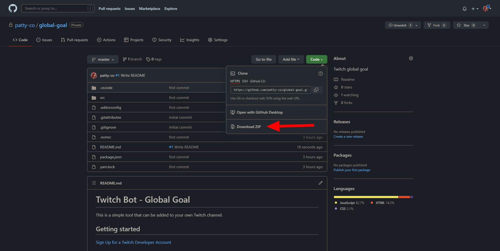
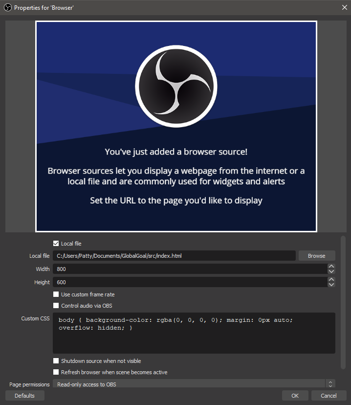

# Twitch Bot - Global Goal

This is a simple tool that can be added to your own Twitch channel.

## Getting started

[Sign Up for a Twitch Developer Account](https://dev.twitch.tv/)

[OAuth Scopes](https://dev.twitch.tv/docs/authentication#scopes)

After signing up, you can get your token by visiting:

https://id.twitch.tv/oauth2/authorize?client_id=CLIENT_ID&redirect_uri=YOUR_HOST&response_type=token&scope=chat:read+chat:edit+channel:moderate

After authorizing, you will be rdirected to `YOUR_HOST` and the access token will be in the URL `access_token` param.

Replace `CLIENT_ID` and `YOUR_HOST` with the values for your newly created Twitch application from the dev portal.

## Use it on your stream

1. Download the files from this repository.



2. Add a browser source on your obs and choose read from local file



The tool will always run when your obs is open but it doesn't save when you close it!
If you want your goal to continue to another stream make sure you take note of the percentage you have when ending the stream and change the values for next stream.

There's 2 places you have to change it.

src/index.html

```html
<p><b id="displayPercentage">0</b>%</p>
```

and src/js/chatconnect.js

```javascript
let currentPercentage = 0;
let displayPercentage = 0;
```

## Editing Values

The only file you need to change for editing goal and values is the src/js/constants.js 

```javascript
const GOAL_AMOUNT = 100; 
const SUB_VALUE = 2.5;
const T2_VALUE = 5;
const T3_VALUE = 12.5;
const CHEER_VALUE = 0.01;
```

You need to change your donation bot information accordingly

```javascript
// The bot you use that sends a message to chat about the donation
const DONATION_BOT_NAME = 'streamelements';

// A unique message the bot says when someone donates
// For example my message is "{user} just tipped {currency}{amount} PogChamp"
const DONATION_UNIQUE_MESSAGE = 'just tipped';
```

## Font and colors

In the file src/css/style.css

```css
  /* change font */
  font-family: "Cooper Black";
  
  /* change color with hex code */
  color: #264d70;

  /* change color with rgb code */
  color: rgb(255,0,0);

  /* change font size here */
  font-size: 75px;
```

## Credits
Created by Patty with 💛

🔔 Social Media 🔔

► Twitch https://www.twitch.tv/patty_co

► Twitter  https://twitter.com/patty_co__

► Instagram https://www.instagram.com/patty_co_dev

► GitHub https://github.com/patty-co
